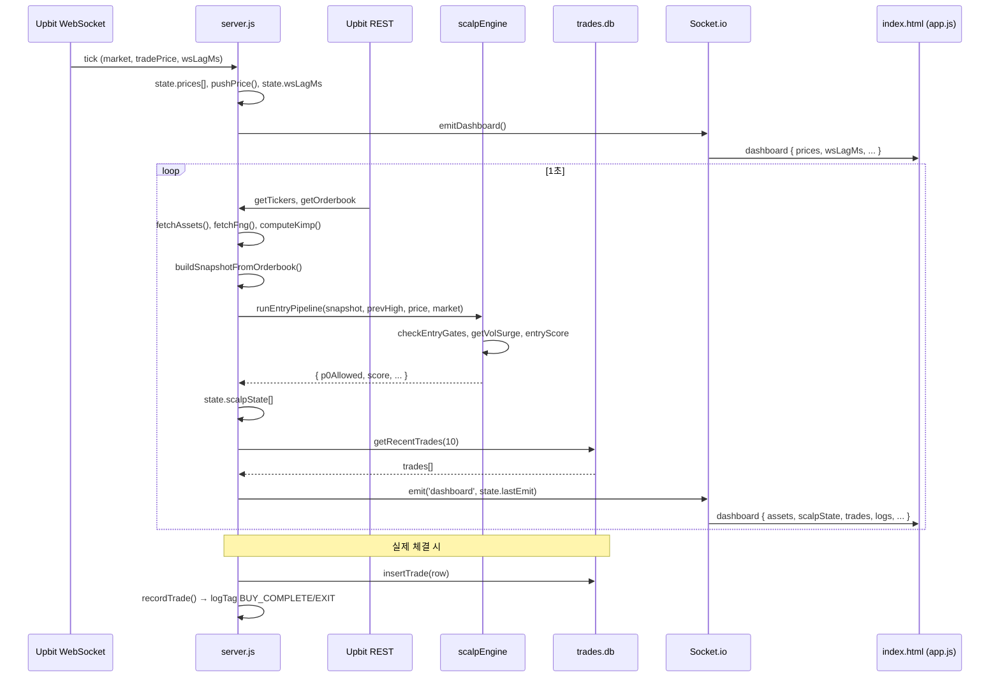
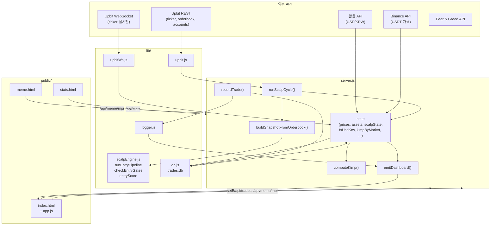
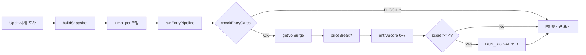

# 업비트 스캘핑 HTS · 아키텍처 및 데이터 흐름

공부 목적의 프로젝트 구조, 데이터 흐름, 소스 연결 관계, SCALP 명세 매핑, 시각화를 정리한 문서입니다.

---

## 1. 전체 프로젝트 구조

```
dashboard/
├── server.js                 # 진입점: Express + Socket.io, 상태 집약, SCALP 주기 실행
├── config.json               # Upbit API 키 (access_key, secret_key) — Git 제외 권장
├── .env                      # 선택: PORT, UPBIT_ACCESS_KEY, UPBIT_SECRET_KEY 등
├── package.json
├── trades.db                 # SQLite DB (실제 매매 기록, 통계용) — 런타임 생성
├── SCALP_LOGIC_FOR_NODEJS.md # SCALP 규칙 명세 (P0, Vol Surge, Entry Score, 청산)
│
├── lib/
│   ├── upbit.js              # Upbit REST: getTickers, getOrderbook, getAccounts, summarizeAccounts
│   ├── upbitWs.js            # Upbit WebSocket: subscribeTicker (실시간 시세 + wsLagMs)
│   ├── scalpEngine.js        # SCALP 로직: checkEntryGates, getVolSurge, entryScore, shouldExitScalp, runEntryPipeline
│   ├── db.js                 # SQLite: init, insertTrade, getRecentTrades, getStats, cleanupOldNonTrades
│   ├── logger.js             # trade.log 파일 + 실시간 로그 버퍼 (logTag, getRecentLogs)
│   └── meme/
│       ├── memeEngine.js     # MPI 계산·히스토리, getAllMPI, getHistory
│       ├── mpiCalculator.js  # MPI = f(S,T,N,O,F)
│       └── ...               # Reddit, Binance Futures, 뉴스 등 데이터 소스
│
├── public/
│   ├── index.html            # 메인 대시보드: 자산·시세·Entry Score·P0 뱃지·로그·거래내역
│   ├── meme.html             # MPI 상세: 점수·컴포넌트 게이지·해석 모달
│   ├── stats.html            # 수익률 통계: 승률·MDD·시간대별/코인별/청산사유 차트
│   └── js/
│       └── app.js            # index 전용: Socket.io 수신, 자산/가격/스캘프/로그/거래 렌더링
│
├── logs/
│   ├── trade.log             # logger.js에 의한 거래·신호 로그
│   └── meme_engine.log
└── docs/
    └── ARCHITECTURE_AND_DATA_FLOW.md  # 본 문서
```

### 주요 파일 역할 요약

| 파일 | 역할·책임 |
|------|------------|
| **server.js** | HTTP 라우팅(/, /meme, /stats, /api/*), 전역 state 보관, 1초 폴링(자산·FNG·DB·SCALP), FX/Binance 1분 폴링, 김프 계산, 4시간 DB 클리닝, Socket.io로 `dashboard` 이벤트 1초마다 브로드캐스트, `setBot` 수신 |
| **index.html** | 메인 HTS UI: 자산 카드(매수/평가/USD/손익/수익률), 코인 시세·Entry Score 게이지·P0 뱃지, 실시간 로그, 거래 내역, F&G·MPI 위젯, bot 토글 |
| **stats.html** | 수익률 분석 페이지: /api/stats로 통계 로드, 승률·MDD·보유시간·수수료·시간대별 승률(막대)·코인별 수익(파이)·청산 사유(도넛)·일별 수익(라인) |
| **meme.html** | MPI 전용: /api/meme/mpi로 MPI·컴포넌트·히스토리 로드, 점수 클릭 시 해석 모달 |
| **trades.db** | SQLite: `trades` 테이블(실제 매수/매도만 영구 보존). 통계·최근 10건·4시간 클리닝 대상(비거래 로그) 저장소 |

---

## 2. 데이터 흐름 (Data Flow)

### 2.1 시세 수집 → SCALP 판단 → DB → 프론트 시각화 (단계별)

```
[1] 시세 수집
    ├─ Upbit WebSocket (upbitWs.subscribeTicker)
    │  → 틱 수신 시 state.prices[market] 갱신, pushPrice(market, price), wsLagMs 저장
    │  → 수신 직후 emitDashboard() 호출 (즉시 프론트 반영)
    │
    └─ Upbit REST (1초 주기 setInterval ASSET_POLL_MS)
       → upbit.getTickers(SCALP_MARKETS), upbit.getOrderbook(SCALP_MARKETS)
       → runScalpCycle() 내부에서 ticker·orderbook 사용

[2] 스냅샷·김프
    ├─ fetchFx() / fetchBinance() (1분 주기) → state.fxUsdKrw, state.binancePrices
    ├─ computeKimp() → state.kimpByMarket, state.kimpAvg
    │  공식: 적정KRW = 바이낸스USD × 환율, 김프% = (업비트가격/적정KRW - 1)×100
    └─ buildSnapshotFromOrderbook(ob, ticker, market)
       → spread_ratio, topN_depth_bid/ask, strength_proxy_60s, obi_topN, kimp_pct 등
       → snapshot은 scalpEngine.runEntryPipeline() 입력

[3] SCALP 판단 (runScalpCycle)
    ├─ getPrevHigh(market) ← priceHistory[market] (최근 60개 가격 중 max)
    ├─ scalpEngine.runEntryPipeline(snapshot, prevHigh, currentPrice, market)
    │  ├─ checkEntryGates(snapshot) → BLOCK_KIMP(김프>3%), BLOCK_SPREAD, BLOCK_LAG 등
    │  ├─ getVolSurge(snapshot)
    │  ├─ priceBreak = currentPrice > prevHigh + entry_tick_buffer * tickSize
    │  └─ entryScore(snapshot, priceBreak, volSurge) → 0~7
    ├─ nextScalpState[market] = { entryScore, p0GateStatus, strength_proxy_60s }
    ├─ state.scalpState = nextScalpState
    └─ 진입 조건 충족 시에만 tradeLogger.logTag('BUY_SIGNAL', ...) (로그창만)

[4] DB 저장
    ├─ 실제 체결 시 server.recordTrade(row) 호출
    │  → db.insertTrade(row) → trades.db에 INSERT
    │  → side=buy → [BUY_COMPLETE], side=sell → [EXIT] Reason, Profit% 로그
    ├─ 1초마다 state.trades = db.getRecentTrades(10) (emit용)
    └─ 4시간마다 db.cleanupOldNonTrades(4) (side가 buy/sell이 아닌 오래된 행만 DELETE)

[5] 프론트 시각화 (index.html + app.js)
    ├─ Socket.io로 1초마다 'dashboard' 이벤트 수신
    ├─ data.assets → renderAssets (총매수/평가/USD/손익/수익률)
    ├─ data.prices → renderPrices (가격 플래시 up/down)
    ├─ data.scalpState → renderScalpState (Entry Score 게이지, P0 뱃지, Strength 바)
    ├─ data.logs → renderLogs (BUY_SIGNAL/BUY_COMPLETE/EXIT/에러만 색상·알림)
    ├─ data.trades → renderTrades (최근 10건)
    ├─ data.fxUsdKrw, data.kimpAvg → 헤더 FX·김프
    └─ data.wsLagMs → WS Lag 표시
```

### 2.2 시퀀스 다이어그램 (Mermaid)



---

## 3. 소스 간 연결 관계

### 3.1 Socket.io 이벤트

| 방향 | 이벤트명 | 주체 | payload / 설명 |
|------|----------|------|-----------------|
| 서버 → 클라이언트 | **dashboard** | server.js | 1초마다 브로드캐스트. `{ assets, prices, fng, botEnabled, trades, scalpState, wsLagMs, logs, fxUsdKrw, kimpAvg, kimpByMarket }` |
| 클라이언트 → 서버 | **setBot** | app.js (index) | 사용자가 SCALP ON/OFF 토글 시. payload: `boolean` (enabled) |

- **index.html**만 Socket.io 사용 (app.js에서 `io()` 연결, `socket.on('dashboard', ...)`, `socket.emit('setBot', next)`).
- **meme.html**, **stats.html**은 Socket 미사용, HTTP API만 사용.

### 3.2 HTML ↔ API 요청·출력

| 페이지 | 요청 | 출력 |
|--------|------|------|
| **index.html** | `GET /` (HTML), `GET /api/trades` (초기 거래 10건), `GET /api/meme/mpi` (MPI 위젯 60초 주기), `GET /api/check-upbit` (API 연결 확인 버튼) | Socket `dashboard`로 자산·가격·스캘프 상태·로그·거래·FX·김프·WS Lag 실시간 갱신. MPI 위젯·F&G 게이지 |
| **meme.html** | `GET /meme` (HTML), `GET /api/meme/mpi` (10초 주기) | MPI 점수·velocity·컴포넌트(S,T,N,O,F) 게이지·테이블·히스토리. 점수 클릭 시 해석 모달 |
| **stats.html** | `GET /stats` (HTML), `GET /api/stats` (1회 로드) | 승률·총수익·MDD·평균보유·수수료·전체거래·환율·자산USD. Chart.js: 시간대별 승률(막대)·코인별 수익(파이)·청산 사유(도넛)·일별 수익(라인) |

---

## 4. SCALP_LOGIC_FOR_NODEJS.md → 구현 매핑

명세 항목과 server.js / lib/scalpEngine.js 의 함수·변수 대응입니다.

| 명세 (SCALP_LOGIC) | 구현 위치 | 함수/변수/비고 |
|--------------------|------------|----------------|
| **1.1 P0 상수** (max_spread_pct, min_depth_qty, ws_lag_ms_max 등) | lib/scalpEngine.js | `DEFAULT_PROFILE`, `profile` |
| **1.2 P1 상수** (entry_score_min, strength_threshold, obi_threshold 등) | lib/scalpEngine.js | `DEFAULT_PROFILE`, `profile` |
| **1.3 청산 상수** (time_stop_sec, stop_loss_pct, weakness_drop_ratio 등) | lib/scalpEngine.js | `DEFAULT_PROFILE`, `shouldExitScalp()` 내부 |
| **Step 1 P0 게이트** (스냅 없음, spread_anomaly, 스프레드, 호가깊이, 지연, 슬리피지) | lib/scalpEngine.js | `checkEntryGates(snapshot)` |
| **김프 > 3% 진입 금지** | lib/scalpEngine.js | `checkEntryGates()` 내부 `snapshot.kimp_pct > 3` → `BLOCK_KIMP` |
| **Snapshot 생성** (spread_ratio, topN_depth, strength, obi, kimp_pct 등) | server.js | `buildSnapshotFromOrderbook(orderbookItem, ticker, market)` |
| **Step 2 Vol Surge** | lib/scalpEngine.js | `getVolSurge(snapshot)` |
| **Step 3 Price break** (prev_high + N ticks) | server.js + scalpEngine | server: `getPrevHigh(market)`, tickSize; scalpEngine: `runEntryPipeline()` 내 threshold = prevHigh + bufferTicks * tickSize |
| **Step 4 Entry Score 0~7** | lib/scalpEngine.js | `entryScore(snapshot, priceBreak, volSurge)` |
| **진입 파이프라인 Step 1~4** | lib/scalpEngine.js | `runEntryPipeline(snapshot, prevHigh, currentPrice, market)` |
| **진입 조건 score >= entry_score_min** | server.js | `runScalpCycle()` 내 `pipeline.p0Allowed && pipeline.score >= profile.entry_score_min` → BUY_SIGNAL 로그 |
| **청산: time_stop, stop, weakness** | lib/scalpEngine.js | `shouldExitScalp(position, snapshot, currentPrice)` |
| **prev_high (과거 구간 high)** | server.js | `priceHistory[market]`, `getPrevHigh(market)` (최근 60개 가격 중 max) |
| **틱 크기** | lib/scalpEngine.js | `TICK_SIZE_BY_MARKET`, `getTickSize(market)` |

---

## 5. 구조도·데이터 흐름 시각화

### 5.1 시스템 구성도 (Mermaid)



### 5.2 SCALP 판단 흐름 (한 코인 기준)



---

## 6. 요약

- **시세**: Upbit WebSocket(실시간) + REST(1초 주기) → `state.prices`·`priceHistory` → 스냅샷·prevHigh·SCALP 입력.
- **SCALP**: `buildSnapshotFromOrderbook` + `computeKimp` → `scalpEngine.runEntryPipeline` → P0·Vol Surge·Entry Score → 결과는 `state.scalpState`와 로그(BUY_SIGNAL만).
- **DB**: 실제 체결 시 `recordTrade` → `db.insertTrade` + 로그. 1초마다 `getRecentTrades(10)`로 emit. 4시간마다 비거래 로그만 삭제.
- **프론트**: index는 Socket `dashboard`로 전부 실시간 갱신; meme·stats는 HTTP API만 사용.
- **명세**: SCALP_LOGIC_FOR_NODEJS.md의 P0/P1/청산 상수·단계는 `lib/scalpEngine.js`의 `DEFAULT_PROFILE`, `checkEntryGates`, `getVolSurge`, `entryScore`, `shouldExitScalp`, `runEntryPipeline` 및 server.js의 `buildSnapshotFromOrderbook`, `getPrevHigh`, `runScalpCycle`에 매핑됩니다.
